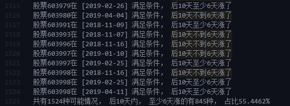

# quantitative-investment-learning

使用Python进行量化投资的学习报告
**Python量化投资学习报告**

`CatsJuice` 编辑于 `2019-4-26`

上一次更新： `2019-05-21 16:04`

**CONTENTS:**

- [quantitative-investment-learning](#quantitative-investment-learning)
- [1. **数据抓取**](#1-%e6%95%b0%e6%8d%ae%e6%8a%93%e5%8f%96)
  - [1.1. **通过第三方数据平台直接调用api**](#11-%e9%80%9a%e8%bf%87%e7%ac%ac%e4%b8%89%e6%96%b9%e6%95%b0%e6%8d%ae%e5%b9%b3%e5%8f%b0%e7%9b%b4%e6%8e%a5%e8%b0%83%e7%94%a8api)
    - [1.1.1. **TuShare(挖地兔)**](#111-tushare%e6%8c%96%e5%9c%b0%e5%85%94)
      - [1.1.1.1. **A. 概述**](#1111-a-%e6%a6%82%e8%bf%b0)
      - [1.1.1.2. **B. 基本使用**](#1112-b-%e5%9f%ba%e6%9c%ac%e4%bd%bf%e7%94%a8)
    - [1.1.2. **其他平台**](#112-%e5%85%b6%e4%bb%96%e5%b9%b3%e5%8f%b0)
      - [1.1.2.1. **Win.d**](#1121-wind)
      - [1.1.2.2. **优矿**](#1122-%e4%bc%98%e7%9f%bf)
  - [1.2. **使用爬虫抓取**](#12-%e4%bd%bf%e7%94%a8%e7%88%ac%e8%99%ab%e6%8a%93%e5%8f%96)
    - [1.2.1. **新浪财经**](#121-%e6%96%b0%e6%b5%aa%e8%b4%a2%e7%bb%8f)
      - [1.2.1.1. **获取所有股票代码**（这里只考虑沪深A股）](#1211-%e8%8e%b7%e5%8f%96%e6%89%80%e6%9c%89%e8%82%a1%e7%a5%a8%e4%bb%a3%e7%a0%81%e8%bf%99%e9%87%8c%e5%8f%aa%e8%80%83%e8%99%91%e6%b2%aa%e6%b7%b1a%e8%82%a1)
      - [1.2.1.2. **获取日线数据**](#1212-%e8%8e%b7%e5%8f%96%e6%97%a5%e7%ba%bf%e6%95%b0%e6%8d%ae)
      - [1.2.1.3. **获取财务数据**](#1213-%e8%8e%b7%e5%8f%96%e8%b4%a2%e5%8a%a1%e6%95%b0%e6%8d%ae)
    - [1.2.2. **网易财经**](#122-%e7%bd%91%e6%98%93%e8%b4%a2%e7%bb%8f)
      - [1.2.2.1. **获取所有股票代码**（这里只考虑沪深A股）](#1221-%e8%8e%b7%e5%8f%96%e6%89%80%e6%9c%89%e8%82%a1%e7%a5%a8%e4%bb%a3%e7%a0%81%e8%bf%99%e9%87%8c%e5%8f%aa%e8%80%83%e8%99%91%e6%b2%aa%e6%b7%b1a%e8%82%a1)
      - [1.2.2.2. **获取日线数据**](#1222-%e8%8e%b7%e5%8f%96%e6%97%a5%e7%ba%bf%e6%95%b0%e6%8d%ae)
      - [1.2.2.3. **网易财经财务数据**](#1223-%e7%bd%91%e6%98%93%e8%b4%a2%e7%bb%8f%e8%b4%a2%e5%8a%a1%e6%95%b0%e6%8d%ae)
    - [1.2.3. **东方财富**](#123-%e4%b8%9c%e6%96%b9%e8%b4%a2%e5%af%8c)
      - [1.2.3.1. **股票信息列表**](#1231-%e8%82%a1%e7%a5%a8%e4%bf%a1%e6%81%af%e5%88%97%e8%a1%a8)
      - [1.2.3.2. **交易数据, 财务数据**](#1232-%e4%ba%a4%e6%98%93%e6%95%b0%e6%8d%ae-%e8%b4%a2%e5%8a%a1%e6%95%b0%e6%8d%ae)
- [2. **热点获取**](#2-%e7%83%ad%e7%82%b9%e8%8e%b7%e5%8f%96)
  - [2.1. **东方财富**](#21-%e4%b8%9c%e6%96%b9%e8%b4%a2%e5%af%8c)
- [3. **数据分析**](#3-%e6%95%b0%e6%8d%ae%e5%88%86%e6%9e%90)
  - [3.1. **换手率分析**](#31-%e6%8d%a2%e6%89%8b%e7%8e%87%e5%88%86%e6%9e%90)
  - [3.2. **CCI指标**](#32-cci%e6%8c%87%e6%a0%87)
    - [3.2.1. **概念**](#321-%e6%a6%82%e5%bf%b5)
    - [3.2.2. **指标用法**](#322-%e6%8c%87%e6%a0%87%e7%94%a8%e6%b3%95)
    - [3.2.3. **公式**](#323-%e5%85%ac%e5%bc%8f)
      - [3.2.3.1. **公式一：**](#3231-%e5%85%ac%e5%bc%8f%e4%b8%80)
      - [3.2.3.2. **公式二：**](#3232-%e5%85%ac%e5%bc%8f%e4%ba%8c)
    - [3.2.4. **程序设计**](#324-%e7%a8%8b%e5%ba%8f%e8%ae%be%e8%ae%a1)
    - [3.2.5. **参数说明**](#325-%e5%8f%82%e6%95%b0%e8%af%b4%e6%98%8e)
    - [3.2.6. **测试结果**](#326-%e6%b5%8b%e8%af%95%e7%bb%93%e6%9e%9c)
  - [3.3. **《胡立阳股票投资100招》** 由“价量关系”来为个股打分数](#33-%e8%83%a1%e7%ab%8b%e9%98%b3%e8%82%a1%e7%a5%a8%e6%8a%95%e8%b5%84100%e6%8b%9b-%e7%94%b1%e4%bb%b7%e9%87%8f%e5%85%b3%e7%b3%bb%e6%9d%a5%e4%b8%ba%e4%b8%aa%e8%82%a1%e6%89%93%e5%88%86%e6%95%b0)
    - [3.3.1. **概念**](#331-%e6%a6%82%e5%bf%b5)
    - [3.3.2. **程序设计**](#332-%e7%a8%8b%e5%ba%8f%e8%ae%be%e8%ae%a1)
    - [3.3.3. **结果**](#333-%e7%bb%93%e6%9e%9c)
    - [3.3.4. **Source Code**](#334-source-code)
  - [3.4. **移动平均线分析**](#34-%e7%a7%bb%e5%8a%a8%e5%b9%b3%e5%9d%87%e7%ba%bf%e5%88%86%e6%9e%90)
    - [3.4.1. **概念**](#341-%e6%a6%82%e5%bf%b5)
    - [3.4.2. **计算**](#342-%e8%ae%a1%e7%ae%97)
    - [3.4.3. **程序设计**](#343-%e7%a8%8b%e5%ba%8f%e8%ae%be%e8%ae%a1)
    - [3.4.4. **参数说明**](#344-%e5%8f%82%e6%95%b0%e8%af%b4%e6%98%8e)
    - [3.4.5. **购买策略分析**](#345-%e8%b4%ad%e4%b9%b0%e7%ad%96%e7%95%a5%e5%88%86%e6%9e%90)
      - [3.4.5.1. **策略一： '老太太选股法' 一根均线打天下**](#3451-%e7%ad%96%e7%95%a5%e4%b8%80-%e8%80%81%e5%a4%aa%e5%a4%aa%e9%80%89%e8%82%a1%e6%b3%95-%e4%b8%80%e6%a0%b9%e5%9d%87%e7%ba%bf%e6%89%93%e5%a4%a9%e4%b8%8b)
      - [3.4.5.2. **策略二：'黄金交叉'和'死亡交叉'**](#3452-%e7%ad%96%e7%95%a5%e4%ba%8c%e9%bb%84%e9%87%91%e4%ba%a4%e5%8f%89%e5%92%8c%e6%ad%bb%e4%ba%a1%e4%ba%a4%e5%8f%89)
    - [3.4.6. **分析结果**](#346-%e5%88%86%e6%9e%90%e7%bb%93%e6%9e%9c)
      - [3.4.6.1. **老太太选股法**](#3461-%e8%80%81%e5%a4%aa%e5%a4%aa%e9%80%89%e8%82%a1%e6%b3%95)
      - [3.4.6.2. **'黄金交叉'和'死亡交叉'**](#3462-%e9%bb%84%e9%87%91%e4%ba%a4%e5%8f%89%e5%92%8c%e6%ad%bb%e4%ba%a1%e4%ba%a4%e5%8f%89)
    - [3.4.7. **Source Code**](#347-source-code)
  - [3.5. **分时数据 成交手分析**](#35-%e5%88%86%e6%97%b6%e6%95%b0%e6%8d%ae-%e6%88%90%e4%ba%a4%e6%89%8b%e5%88%86%e6%9e%90)
    - [3.5.1. **基本概念**](#351-%e5%9f%ba%e6%9c%ac%e6%a6%82%e5%bf%b5)
    - [3.5.2. **分析的形态**](#352-%e5%88%86%e6%9e%90%e7%9a%84%e5%bd%a2%e6%80%81)
    - [3.5.3. **程序设计**](#353-%e7%a8%8b%e5%ba%8f%e8%ae%be%e8%ae%a1)
    - [3.5.4. **参数说明**](#354-%e5%8f%82%e6%95%b0%e8%af%b4%e6%98%8e)
    - [3.5.5. **结果及分析**](#355-%e7%bb%93%e6%9e%9c%e5%8f%8a%e5%88%86%e6%9e%90)
    - [3.5.6. **Source Code**](#356-source-code)
  - [3.6. **MACD**](#36-macd)
    - [3.6.1. **基本概念**](#361-%e5%9f%ba%e6%9c%ac%e6%a6%82%e5%bf%b5)
      - [3.6.1.1. **MACD**](#3611-macd)
      - [3.6.1.2. **MACD 金叉**](#3612-macd-%e9%87%91%e5%8f%89)
      - [3.6.1.3. **MACD 死叉**](#3613-macd-%e6%ad%bb%e5%8f%89)
    - [3.6.2. **程序设计**](#362-%e7%a8%8b%e5%ba%8f%e8%ae%be%e8%ae%a1)
      - [3.6.2.1. **数据计算**](#3621-%e6%95%b0%e6%8d%ae%e8%ae%a1%e7%ae%97)
      - [3.6.2.2. **数据分析**](#3622-%e6%95%b0%e6%8d%ae%e5%88%86%e6%9e%90)
    - [3.6.3. **参数说明**](#363-%e5%8f%82%e6%95%b0%e8%af%b4%e6%98%8e)
    - [3.6.4. **function注释**](#364-function%e6%b3%a8%e9%87%8a)
    - [3.6.5. **结果分析**](#365-%e7%bb%93%e6%9e%9c%e5%88%86%e6%9e%90)
    - [3.6.6. **Source Code**](#366-source-code)

# 1. **数据抓取**

## 1.1. **通过第三方数据平台直接调用api**

### 1.1.1. **TuShare(挖地兔)**

#### 1.1.1.1. **A. 概述**

> **Tushare**是一个免费、开源的python财经数据接口包。主要实现对股票等金融数据从**数据采集**、**清洗加工** 到**数据存储**的过程，能够为金融分析人员提供快速、整洁、和多样的便于分析的数据，为他们在数据获取方面极大地减轻工作量，使他们更加专注于策略和模型的研究与实现上。

接口文档地址：[http://tushare.org/](http://tushare.org/) 

ToShare Pro: [https://tushare.pro/](https://tushare.pro/)

#### 1.1.1.2. **B. 基本使用**

**使用前提**:

- 安装Python
- 安装Pandas, lxml

**下载安装**:

- 方式1：`pip install tushare`
- 方式2：访问[https://pypi.python.org/pypi/Tushare/](https://pypi.python.org/pypi/Tushare/)下载安装

**使用**:

以[历史行情](http://tushare.org/trading.html#id2)接口为例， 如下调用:

```python
import tushare as ts

ts.get_hist_data('600848')      #一次性获取全部日k线数据
```

**结果显示**:


> `Tushare`返回的绝大部分的数据格式都是`pandas DataFrame`类型，非常便于用`pandas` / `NumPy` / `Matplotlib`进行数据分析和可视化

### 1.1.2. **其他平台**

#### 1.1.2.1. **Win.d**

官网: [https://www.wind.com.cn/Default.html](https://www.wind.com.cn/Default.html)
>中国市场的精准金融数据服务供应商，为量化投资与各类金融业务系统提供准确、及时、完整的落地数据，内容涵盖
股票、债券、基金、衍生品、指数、宏观行业等各类金融市场数据，助您运筹帷幄，决胜千里

#### 1.1.2.2. **优矿**

官网: [https://uqer.io/](https://uqer.io/)
> 提供各类资产的财务、因子、主题、宏观行业特色大数据，以及量化场景下的PIT数据，保障量化过程不引入未来数据。
> 股票、期货、指数、场内外基金等多资产多策略回测。丰富的衍生工具，保证多因子策略、事件驱动等快速实现。

## 1.2. **使用爬虫抓取**

手动写爬虫进行抓取， 首先需要确定数据来源， 较为主流的财经数据平台有**新浪财经**， **东方财富**， **网易财经**等。 接下来针对若干平台， 分析抓取的过程以及可能遇到的问题；

### 1.2.1. **新浪财经**

#### 1.2.1.1. **获取所有股票代码**（这里只考虑沪深A股）

新浪财经的数据地址为[http://vip.stock.finance.sina.com.cn/q/go.php/vIR_CustomSearch/index.phtml](http://vip.stock.finance.sina.com.cn/q/go.php/vIR_CustomSearch/index.phtml), 通过切换页面可以发现， 地址栏的url的参数发生了变化，变化的规律为：`p=n`, `n`为当前页码， 而股票代码和股票名称， 通过`F12`打开开发者工具, 表单中的值均可定位到， 应该可以通过爬虫抓取所有股票的基本信息， 通过新浪财经抓取股票的代码我这里没有写， 暂先略过；

#### 1.2.1.2. **获取日线数据**

在新浪财经数据中心， 我并没有找到**交易数据**的表格， 要查看某只股票的**日线** / **分线**只能通过点击某只股票进到[详情页](https://finance.sina.com.cn/realstock/company/sh601789/nc.shtml)(而url中的股票代码对应着不同的股票)， 而新浪财经的数据并非以表格的形式展示， 而是通过图表展示， 鼠标移动时通过`JavaScript`更新日期及当前股票的数据信息；那么直接抓取网页是无法获取到数据的， 现在的思路是分析js文件， 找到鼠标移动时监听到的事件， 查明js是如何更新数据的， js的数据从哪里提取，以此来抓取信息;

首先， 通过页面元素审查可以发现， 分时线是通过`HTML5`的`canvas`绘制的， 在Sources找相关的js文件， 可以找到`paintSth.js`文件， 由于在鼠标移动时会更新页面元素， 所以可以直接在文件中查找`mousemove`， 找到了相关代码如下:

```js
C = this.interactCanvas,
...
...
...
C.addEventListener("mousemove", o),
```

可以看到Canvas加了一个mousemove的监听器， 执行`o`, 再查找`o()`, 可以找到如下代码：

```js
function o() {
    if (!c) {
        var t = document.createElement("canvas");
        c = t.getContext("2d")
    }
    return c
}
```

这里`c`又是一个未知量， 所以应该继续检索`c`的信息， 由于关联的js文件较多， 这种做法过于费时费力， 爬取新浪财经的交易数据应该不是明智的选择；

**换种思路**， 既然可以浏览， 那么使用 `selenium` 就有可能， `selenium` 可以进行自动化测试， 让鼠标在固定位置移动， 同时抓取更新的信息， 这种做法是可行的， 我也尝试着做了， 由于这一方法过于不实用， 源码略；

**这种做法局限性太大**， 首先， **效率过低**， 这是很致命的一个缺陷， 除此之外， 由于移动导致的像素不同， 可能会出现数据遗漏或重复；最后， 新浪财经默认只显示一定日期的交易数据， 要查看更早的需要手动拖动进度条， 这就使得`selenium`的操作误差更大；

综上所述， 在新浪抓取交易数据是挺不容易的事情；

#### 1.2.1.3. **获取财务数据**

新浪的财务数据在[http://vip.stock.finance.sina.com.cn/q/go.php/vFinanceAnalyze/kind/profit/index.phtml?p=1](http://vip.stock.finance.sina.com.cn/q/go.php/vFinanceAnalyze/kind/profit/index.phtml?p=2), 这应该是爬虫抓取中喜闻乐见的格式了，换页不需要通过ajax， 所以抓取的时候只需要设定好抓取的总页数， 循环抓取页面再解析即可， 接下来即可直接进行代码的编写（未亲自验证）

### 1.2.2. **网易财经**

#### 1.2.2.1. **获取所有股票代码**（这里只考虑沪深A股）

网易财经的所有沪深A股数据位于[http://quotes.money.163.com/old/#query=EQA&DataType=HS_RANK&sort=PERCENT&order=desc&count=24&page=0](http://quotes.money.163.com/old/#query=EQA&DataType=HS_RANK&sort=PERCENT&order=desc&count=24&page=0), 从`url`来看， 换页通过url传参即可改变了， 但是实际操作可以发现， 点击换页时`url`中的`page`并不会改变， 但改变`url`中的`page`参数， 当前页面序号会改变；但这不意味着可以像[1.2.1. **新浪财经**](#121-新浪财经)中爬取新浪财经一样， 枚举url的page参数来爬取所有信息；因为股票数据是异步加载的， 直接抓取无法获取到值；

对于网易财经，由于点击换页时页面的url没有更新，所以应该是使用了`Ajax`或`Js`来更新数据， 通过`F12`调起开发者工具， 在`Network`选型卡中， 筛选`XHR`, 每当点击换页时， 就会有新的`XHR`， 分析这些`XHR`的url可以发现，只有`page`值在改变：


直接复制`Request URL`并使用浏览器访问， 可以得到`json`格式的数据， 但是可以看到中文通过`Unicode`编码了， 在获取后， 可以通过`s.decode('unicode_escape')`来解码；接下来就是对`json`解析并提取需要的信息了， json格式如下：


在`list`中有`[0]`到`[23]`共24条数据， 对应请求中的参数`count=24`， 关于字段名的解释， 以下为我的分析：

No. | key_name | meaning
:--:| :--: | :--:
1 | ANNOUNMT | 公告信息，并非必须，对应在页面中有公告标签的股票才有这个字段
2 | CODE | 股票代码
3 | FIVE_MINUTE | 5分钟涨跌额
4 | HIGH | 最高
5 | HS | 换手率(不带%)
6 | LB | 量比
7 | LOW | 最低
8 | MCAP | 流通市值
9 | MFRATIO | list, 包含2个值`MFRATIO2`:净利润， `MFRATIO10`: 主营收
10 | MFSUM | 每股收益
11 | NAME | 名称
12 | NO | 网易财经中的编号
13 | OPEN | 今日开盘
14 | PE | 市盈率
15 | PERCENT | 涨跌幅
16 | PRICE | 价格
17 | TCAP | 总市值
18 | TURNOVER | 成交额
19 | VOLUME | 成交量
20 | WB | 委比

&emsp;&emsp;所以可以直接抓取这个url来获取相关的数据， 更有趣的是， 请求参数中有个`count`参数， 决定了数据的数量， 所以我尝试将`count`设置成全部数量, 查看网易财经沪深A股， 网易的编号最后一只为`3607`， 所以如下请求：

```js
'http://quotes.money.163.com/hs/service/diyrank.php?host=http%3A%2F%2Fquotes.money.163.com%2Fhs%2Fservice%2Fdiyrank.php&page=0&query=STYPE%3AEQA&fields=NO%2CSYMBOL%2CNAME%2CPRICE%2CPERCENT%2CUPDOWN%2CFIVE_MINUTE%2COPEN%2CYESTCLOSE%2CHIGH%2CLOW%2CVOLUME%2CTURNOVER%2CHS%2CLB%2CWB%2CZF%2CPE%2CMCAP%2CTCAP%2CMFSUM%2CMFRATIO.MFRATIO2%2CMFRATIO.MFRATIO10%2CSNAME%2CCODE%2CANNOUNMT%2CUVSNEWS&sort=PERCENT&order=desc&count=3607&type=query'
```

即可返回所有`json`格式的数据， 然后再进行解析， 并写入文件， 完整代码如下：

```py
import urllib
import json
import csv
from tqdm import tqdm

# 下载器
class Downloader(object):
    def __init__(self, url):
        self.url = url

    def download(self):
        html_content = urllib.request.urlopen(self.url).read()
        html_content = html_content.decode("utf-8")
        return html_content

# 调度器
class Controller(object):

    def __init__(self):
        self.downloader = None
        self.parser = None
        self.saver = None

    def get_data(self):
        url = "http://quotes.money.163.com/hs/service/diyrank.php?host=http%3A%2F%2Fquotes.money.163.com%2Fhs%2Fservice%2Fdiyrank.php&page=0&query=STYPE%3AEQA&fields=NO%2CSYMBOL%2CNAME%2CPRICE%2CPERCENT%2CUPDOWN%2CFIVE_MINUTE%2COPEN%2CYESTCLOSE%2CHIGH%2CLOW%2CVOLUME%2CTURNOVER%2CHS%2CLB%2CWB%2CZF%2CPE%2CMCAP%2CTCAP%2CMFSUM%2CMFRATIO.MFRATIO2%2CMFRATIO.MFRATIO10%2CSNAME%2CCODE%2CANNOUNMT%2CUVSNEWS&sort=PERCENT&order=desc&count=3607&type=query"
        html_content = urllib.request.urlopen(url).read()
        # 这时候解码可能导致json解析错误!!!!!!!!!!!!!!!!!!!!!!!!!!!!!!!!!!!!!!!!
        # html_content = html_content.decode("unicode_escape")
        # 当数量大于2995会报错， json解析失败， 原因是编号为2996的股票， 在公告中嵌套了引号导致json解析失败
        data = json.loads(html_content)

        self.saver = Saver(data=data)
        self.saver.save()

class Saver(object):

    def __init__(self, data):
        self.data = data
        self.prifix = 'F:\\files\\sharesDatas\\code_list\\'         # 存放目录

    def save(self):
        # 新建文件, 写入文件头
        file_header = ["代码", "名称", '流通市值', '每股收益', '总市值']
        csv_file = open(self.prifix+'沪深A股.csv', 'w', newline='')
        writer = csv.writer(csv_file)
        writer.writerow(file_header)

        list = self.data['list']
        sum = len(list)
        for i in tqdm(range(0, sum)):
            item = list[i]

            # 处理股票代码， 去掉网易财经的0/1前缀， 并使其在Excel中显示正常（加`）
            code = str(item['CODE'])
            code = code[1:7] if len(code) == 7 else code[:]
            code = "`" + code

            row = [code, item['NAME'], item['MCAP'], item['MFSUM'], item['TCAP']]
            csv_file = open(self.prifix + '沪深A股.csv', 'a', newline='')      # 追加
            writer = csv.writer(csv_file)
            writer.writerow(row)


if __name__ == '__main__':
    controller = Controller()
    controller.get_data()
```

#### 1.2.2.2. **获取日线数据**

网易财经的日线交易数据可在[http://quotes.money.163.com/trade/lsjysj_601318.html#06f01](http://quotes.money.163.com/trade/lsjysj_601318.html#06f01)查看， 需要将`url`中的`601318`替换成相应的股票代码， 在这个页面没有换页按钮， 仅显示若干条数据， 但是在数据表的右上角有个`下载数据`的链接， 点击后， 需要勾选需要下载的字段， 点击下载后会下载一个`code.csv`文件， 所以要做的就是抓取下载的真实`url`， 按`F12`打开开发者工具， 点击下载按钮后， 在控制台看到如下提示：


其中已经包含了请求的真实地址， 即：

```js
"http://quotes.money.163.com/service/chddata.html?code=0601318&start=20070301&end=20190426&fields=TCLOSE;HIGH;LOW;TOPEN;LCLOSE;CHG;PCHG;TURNOVER;VOTURNOVER;VATURNOVER;TCAP;MCAP"
```

而想要搞清楚url的参数， 可以转到`submit`的文件， 这里即`b.667271.min.js:1`, 这是一个压缩的js文件， 格式化后， 在最后可以找到如下关键代码：

```js
submit: function() {
    var e = n.value;
    if (e) e = e.replace(/-/g, "");
    var a = i.value;
    if (a) a = a.replace(/-/g, "");
    var o = t.elem.getElementsByTagName("input"),
    r = [];
    for (var d = 0; d < o.length; d++) {
        if (o[d].type == "checkbox" && o[d].checked) {
            r.push(o[d].value)
        }
    }
    var c = "/service/chddata.html?code=" + window["STOCKCODE"];
    e && /^\d{8}$/.test(e) && (c += "&start=" + e);
    a && /^\d{8}$/.test(a) && (c += "&end=" + a);
    r.length && (c += "&fields=" + r.join(";"));
    location.href = c
}
```

能够清楚地看到url的拼接过程， 具体参数如下：

编号 | 参数 | 解释 | 规范
:--: | :--: | :--: | :--:
1 | start | 起始日期 | 年月日直接拼接，如`20190427`，不足2位补0
2 | end | 截止日期 | 年月日直接拼接，如`20190427`，不足2位补0
3 | fields | 即需要下载的字段 | 使用`;`分割，如：`TCLOSE;HIGH;LOW;TOPEN;LCLOSE;CHG;PCHG;TURNOVER;VOTURNOVER;VATURNOVER;TCAP;MCAP` 具体意义不作详述
4 | code | 股票代码 | 关于股票代码， 网易财经的股票代码在传参时， 如果是以`6`开头的股票， 需要在前面加`0`, 而以`0`和`3`开头的股票需要在前面加`1`,如：`1000333`, `1300001`, `0601318`

接下来是做抓取， 抓取就是根据已经获取的**股票代码**， 枚举股票代码并下载对应的日线数据， 仅需注意每次循环最好使用`time.sleep(random.random()*2)`， 否则可能因操作频繁被拒绝访问；下面是部分源代码（注： 这里源代码中的股票代码是实时获取的， 抓取的是**股城网**, 因为只需要抓取股票代码即可）:

```py
import random
import time

from stock.classes.Downloader import Downloader
from stock.classes.Parser import Parser
from stock.classes.Saver import Saver

# 控制器
class Controller(object):

    # 构造函数
    def __init__(self, url, kline_filepath, codelist_filepath, date):
        '''
        :param url: 股票基本信息url（ 股城网>行情>沪深A股 ）
        :param kline_filepath:  日线数据文件保存路径
        :param codelist_filepath:  股票代码文件保存路径
        :param date:  查询截止日期
        '''
        self.url = url
        self.kline_filepath = kline_filepath
        self.codelist_filepath = codelist_filepath
        self.date = date
        self.downloader = None  # 下载器实例
        self.parser = None      # 解析器实例
        self.saver = Saver()    # 存储器实例

    # 执行函数
    def start(self):
        page = 1
        all_code = []
        while page <= 181:
            print("当前为第%s页" % page)
            time.sleep(random.random()*2)
            self.downloader = Downloader(self.url % page)
            page += 1
            html_content = self.downloader.download()
            self.parser = Parser(html_content)
            codeList = self.parser.parseSharesCode()
            for code in codeList:
                all_code.append(code)
            # print(codeList)
            self.saver.saveKlineToCSV(codeList=codeList, filepath=self.kline_filepath, date=self.date)
        self.save(codelist=all_code)

    def save(self,codelist):
        self.saver.saveCodeListToCSV(codeList=codelist, filepath=self.codelist_filepath)  # 保存代码到csv
        # self.saver.saveKlineToMySQL(filepath=self.kline_filepath)                         # 保存所有股票的信息到数据库


# 程序入口
if __name__ == '__main__':
    url = 'https://hq.gucheng.com/HSinfo.html?en_hq_type_code=&sort_field_name=px_change_rate&sort_type=desc&page=%s'   # 股城网>行情>沪深A股
    kline_filepath = 'F:\\files\\sharesDatas\\dayline\\'                  # 定义数据文件保存路径
    codelist_filepath = 'F:\\files\\sharesDatas\\code_list\\'             # 定义数据文件保存路径
    controller = Controller(url=url, kline_filepath=kline_filepath, codelist_filepath=codelist_filepath, date='20190428')
    controller.start()
```

项目地址: [https://github.com/CatsJuice/netease-stock-day-line](https://github.com/CatsJuice/netease-stock-day-line))

`或者:`

```bash
git clone https://github.com/CatsJuice/netease-stock-day-line.git
```

#### 1.2.2.3. **网易财经财务数据**

网页url为[http://quotes.money.163.com/f10/zycwzb_601318.html#01c01](http://quotes.money.163.com/f10/zycwzb_601318.html#01c01)， 可以看到同交易日线数据一样， 这里有一个下载数据的按钮， 对应`盈利能力`， `偿还能力`等， 而这里直接通过开发者工具审查元素， 即可看到超链接的`href`：`/service/zycwzb_601318.html?type=report&part=ylnl`， 很快， 就能拿到完整的`url`， 然后操作同网易日线数据， 项目地址同样位于[https://github.com/CatsJuice/netease-stock-day-line](https://github.com/CatsJuice/netease-stock-day-line))

### 1.2.3. **东方财富**

#### 1.2.3.1. **股票信息列表**

因为没找到合适的页面， 实时资金流向排行[http://data.eastmoney.com/zjlx/detail.html](http://data.eastmoney.com/zjlx/detail.html)爬取所有沪深A股代码， 这里不作详述；

#### 1.2.3.2. **交易数据, 财务数据**

东方财富的交易数据/财务数据我也尝试过使用爬虫爬取， 但是还是要走不少弯路的， 而且可能最后还没成功， 首先， 东方财富的数据页面和其他平台一样， 股票代码在url中， 如[http://data.eastmoney.com/bbsj/yjbb/600175.html](http://data.eastmoney.com/bbsj/yjbb/600175.html)， 直接爬取， 或者使用开发者工具定位页面元素会发现：


对应的数据是乱码的， 而如果继续挖掘其js文件， 是可以找到有加密的函数的，如下图所示：


在这个名字特别明显直白的`js`文件`load_table_data_pc.js?201606021831`中, 可以看到加密， 解密的方法， 这也使得爬取成为可能， 但是太大费周章暂不考虑。

# 2. **热点获取**

## 2.1. **东方财富**

这里我抓取的是东方财富的**国内经济要闻**， 页面地址位于[http://finance.eastmoney.com/news/cgnjj.html](http://finance.eastmoney.com/news/cgnjj.html)

这一页面的新闻列表不是通过Ajax异步加载的， 可以直接抓取， 而页码由url中`cgnjj_x`(x为页码)决定，抓取过程较为简单；这里统计的思路是， 将所有的要闻简述拼接成字符串（以`;`分隔并写入txt作备份）， 然后利用`jieba`库分词并统计词频， 项目地址：[https://github.com/CatsJuice/eastmoney-yaowen-keyword](https://github.com/CatsJuice/eastmoney-yaowen-keyword)

也可以直接`clone`至本地

```bash
git clone https://github.com/CatsJuice/eastmoney-yaowen-keyword.git
```

# 3. **数据分析**

在证券投资中， 有很多技术层面的投资策略， 如各种公式， 通过策略可以筛选出股票， 但并不意味着一定能盈利， 而量化投资可以验证这一策略的可靠性， 接下来就是我对若干策略的验证；

## 3.1. **换手率分析**

分析**连续处于低换手率**的股票， 脱离低换手率后， 出现**连续处于高换手率**， 判断2个时期的**收盘价**均价， 分析满足这一特征的股票的价格是否会上涨；

程序设计的思路如下

- 迭代日线数据文件
- 判断是否是连续高换手率
- 判断是否在连续高换手率后出现连续低换手率
- 结果展示

**注:** 因为数据文件是按日期的倒序排序的， 所以分析迭代时， 先判断是否出现连续高换手率

核心代码如下：

```py
high = []
low = []
for row in arr:
    rate = row[10]
    if rate == "None":
        high = []
        low = []
        continue
    if rate == 0:
        if len(high) >= self.min_days and len(low) >= self.min_days:
            dic = {'high': high, 'low': low}
            self.res.append(dic)
            high = []
            low = []
        continue
    rate = float(rate)
    # 4. 判断是否是 高 换手率
    if rate >= self.border_rate:
        # 4.3 判断是否是: 连续高 ->连续低 -> 结束连续低
        if len(low) >= self.min_days:
            # 符合条件， 写入
            dic = {'high': high, 'low': low}
            self.res.append(dic)
            high = []
            low = []
        elif len(low) > 0:      # 连续低中有值
            # 不满足连续 低， 重置
            high = []
            low = []
        high.append(row)
    elif len(high) < self.min_days:     # 是低换手率， 判断是否前面是连续高换手率
        # 4.1 前面不是连续的高换手率， 重置高换手率数组
        high = []
    else:
        # 4.2 前面是连续高换手率， 地换手率写入
        low.append(row)

    # 判断日期是否已达到最后
    if row[0] <= self.end_date:
        # 判断是否满足条件
        if len(high) >= self.min_days and len(low) >= self.min_days:
            dic = {'high': high, 'low': low}
            self.res.append(dic)
            high = []
            low = []
        break
```

简易流程图如下：


[点此查看流程图原图](./assets/imgs/mind201905012008_origin.png)

程序可调整参数如下：

No | param | type | meaning | demo
:--:|:--:|:--: |:--: |:--:
1 | `file_path_prefix` | `str` | 日线数据目录前缀 | `'F:\\files\\sharesDatas\\kline\\'`
2 | `min_days` |  `int` | 最小连续天数 | `10`
3 | `border_rate` | `float` | 换手率高低边界 | `2`
4 | `end_date` | `str` | 统计的最早日期 | `'2018-12-28'`

程序运行结果截图如下：201905012052.png


完整项目地址：[https://github.com/CatsJuice/low-switch-hand-rate](https://github.com/CatsJuice/low-switch-hand-rate)

或者：

```bash
git clone https://github.com/CatsJuice/low-switch-hand-rate.git
```

## 3.2. **CCI指标**

### 3.2.1. **概念**

> 顺势指标又叫CCI指标，CCI指标是美国股市技术分析 家唐纳德·蓝伯特(Donald Lambert)于20世纪80年代提出的，专门测量股价、外汇或者贵金属交易是否已超出常态分布范围。属于超买超卖类指标中较特殊的一种。波动于正无穷大和负无穷大之间。但是，又不需要以0为中轴线，这一点也和波动于正无穷大和负无穷大的指标不同。

### 3.2.2. **指标用法**

> `1`. 当`CCI`指标曲线在`+100`线～`-100`线的常态区间里运行时,`CCI`指标参考意义不大，可以用KDJ等其它技术指标进行研判。
>
> `2`. 当`CCI`指标曲线从上向下突破`+100`线而重新进入常态区间时，表明市场价格的上涨阶段可能结束，将进入一个比较长时间的震荡整理阶段，应及时平多做空。
>
> `3`. 当`CCI`指标曲线从上向下突破`-100`线而进入另一个非常态区间（超卖区）时，表明市场价格的弱势状态已经形成，将进入一个比较长的寻底过程，可以持有空单等待更高利润。如果`CCI`指标曲线在超卖区运行了相当长的一段时间后开始掉头向上，表明价格的短期底部初步探明，可以少量建仓。`CCI`指标曲线在超卖区运行的时间越长，确认短期的底部的准确度越高。
>
> `4`. `CCI`指标曲线从下向上突破`-100`线而重新进入常态区间时，表明市场价格的探底阶段可能结束，有可能进入一个盘整阶段，可以逢低少量做多。
>
> `5`. `CCI`指标曲线从下向上突破`+100`线而进入非常态区间(超买区)时，表明市场价格已经脱离常态而进入强势状态，如果伴随较大的市场交投，应及时介入成功率将很大。
>
> `6`. `CCI`指标曲线从下向上突破`+100`线而进入非常态区间(超买区)后，只要`CCI`指标曲线一直朝上运行，表明价格依然保持强势可以继续持有待涨。但是，如果在远离`+100`线的地方开始掉头向下时，则表明市场价格的强势状态将可能难以维持，涨势可能转弱，应考虑卖出。如果前期的短期涨幅过高同时价格回落时交投活跃，则应该果断逢高卖出或做空。

### 3.2.3. **公式**

关于公式有两种：

#### 3.2.3.1. **公式一：**

```php
TYP:=(HIGH+LOW+CLOSE)/3;
CCI:(TYP-MA(TYP,N))/(0.015*AVEDEV(TYP,N));
```

该公式来自`通达信`， 含义如下：

```php
TYP赋值:(最高价+最低价+收盘价)/3
输出CCI:(TYP-TYP的N日简单移动平均)/(0.015*TYP的N日平均绝对偏差)
```

#### 3.2.3.2. **公式二：**


该公式摘录于[https://www.joinquant.com/view/community/detail/219](https://www.joinquant.com/view/community/detail/219)

程序中我采用的是**公式二**， 生成的 `CCI` 指标追加到日线文件中， 在相应日期后增加 `CCI` 的值， 在 `Python` 中对 `csv` 文件进行增加列的方法， 在网上可找到的方法较少， 以下为一个提供了多种解决方案的， 较为完善的链接: [https://stackoverflow.com/questions/11070527/how-to-add-a-new-column-to-a-csv-file](https://stackoverflow.com/questions/11070527/how-to-add-a-new-column-to-a-csv-file), 我使用的是 `pandas` 库， 关键代码如下：

```py
df = pd.read_csv(filename, encoding='gbk')
df['cci'] = ''
for index, row in pd.iterrows():
    df.loc[index, 'cci'] = cci
```

### 3.2.4. **程序设计**

**总共设计了4个类如下**:

- `CCIAnalyze(object)` &emsp;&emsp;&emsp;&emsp;&emsp;&emsp;&ensp;//&ensp;&ensp;CCI分析类
  - `analyze_all(self)` &emsp;&emsp;&emsp;&emsp;//&ensp;&ensp;分析所有股票
  - `analyze_one(self)` &emsp;&emsp;&emsp;&emsp;//&ensp;&ensp;分析一只股票
  - `test_buy(self)` &emsp;&emsp;&emsp;&emsp;&emsp;&ensp;//&ensp;&ensp;测试购买（策略一：在下文说明）
  - `test_buy_2(self)` &emsp;&emsp;&emsp;&emsp;&ensp;//&ensp;&ensp;测试购买（策略二：在下文说明）
- `CCICalculate(object)` &emsp;&emsp;&emsp;&emsp;&emsp;//&ensp;&ensp;根据[3.2.3. **公式**](#323-公式)中的公式二计算CCI
- `CCICalculate_2(object)`&emsp;&emsp;&emsp;&emsp;//&ensp;&ensp;根据[3.2.3. **公式**](#323-公式)中的公式一计算CCI
- `BuyInfo(object)`&emsp;&emsp;&emsp;&emsp;&emsp;&emsp;&emsp;&emsp;//&ensp;&ensp;购买辅助类

### 3.2.5. **参数说明**

id | param | type | default | mean | demo | necessary
:--: | :--: | :--: | :--: | :--: |:--: | :--:
1 | `file_path_prefix` | `str` | `None` | 日线数据文件目录前缀 | `'F:\\files\\sharesDatas\\kline\\'` | `True`
2 | `cci_path_prefix` | `str` | `None` | CCI数据将要保存的目录前缀 | `'F:\\files\\sharesDatas\\cci\\'` | `True`
3 | `code` | `str` / `int` | `None` | 股票代码  | `000001` | `False`
4 | `end_date` | `str` | `'0000-00-00'` | 最早的日期（截止日期） | `'2009-01-01'` | `False`

> 项目地址： [https://github.com/CatsJuice/stock-cci](https://github.com/CatsJuice/stock-cci)

或者`clone`:

```bash
git clone https://github.com/CatsJuice/stock-cci
```

### 3.2.6. **测试结果**

在进行测试购买时， 采用的策略有2种，如下：

**策略一**：

对应`CCIAnalyze(object)`中的`test_buy(self)`方法， 当`CCI`向下突破`-100`时， 后一交易日**买入**， 等到`CCI`向上突破`100`时， 后一交易日**卖出**(由于计算出当日的CCI， 当日已不可**买入/卖出**，所以计算后一交易日**买入/卖出**)

**策略二**：

对应`CCIAnalyze(object)`中的`test_buy_2(self)`方法, 当`CCI`向下突破`-100`时， 继续观察， 等到向下达到第一个峰值时， 后一交易日**买入**，等到`CCI`向上突破`100`时， 继续观察， 等到向上达到第一个峰值时， 后一交易日**卖出**（和策略一一样， 计算出`CCI`后只能后一日买入， 而策略二不同的是， 要判断达到第一个峰值， 必须确定峰值后一日CCI降低， 所以测试时， 购买的是峰值的后`第2个`交易日）

经过若干次测试，分别使用的数据是`2019-01-01 ~ 2019-04-26`, `2018-01-01 ~ 2019-04-26`, `2017-01-01 ~ 2019-04-26`, 测试的结果, 购买策略一的收益率大概为`56%`, 可见这个指标有一定依据， 但是盈利的几率不够高; 而策略二的收益率大概为`57%`, 较策略一高一点， 但是依旧无法将其作为购买的唯一指标， 以下是某次运行结果的部分截图：


## 3.3. **《胡立阳股票投资100招》** 由“价量关系”来为个股打分数

### 3.3.1. **概念**

胡立阳根据股票的`价量关系`对股票进行打分（第21招）， 而其打分的依据如下：

> **当日个股表现：**
>
>（1）价涨量增 `+2` 分
>
>（2）价涨量缩 `+1` 分
>
>（3）价跌量增 `-2` 分
>
>（4）价跌量缩 `-1` 分
>
> 每日累计评分。你只要连续计算一个星期,以最高分或者是评分稳定增加的作为你投资的第一选择,因为那只个股具备了“价量配合”的上涨条件

### 3.3.2. **程序设计**

根据以上打分标准， 不难计算每只股票某日的得分， 然后将所有得分排序即可， 这样能够得到某一天的所有股票打分， 而需要验证每只股票是否盈利， 这里我简单地判断后一天收盘价是否比当天高，所以能够得出每只股票是否盈利， 计算出当天得分前`n`只股票的盈利与否， 再用 盈利股票的只数 / n 即当天的盈利率；

以此类推`m`天可得出m天这一策略的盈利几率

程序流程图如下：


[点击此处查看流程图原图](./assets/imgs/mind201904281842.jpeg)

参数详情如下表

id | param | type | mean | demo
:--: | :--: | :--: | :--: | :--:
1 | `prefix` | str | 网易财经日线数据文件前缀 | `'F:\\files\\sharesDatas\\kline\\'`
2 | `date_now` |str| 最新数据的第一个日期, 对应爬取的最新数据表第一行的日期 | `'2019-04-26'` ; Format( `yyyy-mm-dd` )
3 | `days` | int | 加分的天数 | `5`
4 | `calculate_days` | int | 要统计的天数 | `20`
5 | `best_num` | int | 选出的最佳的天数 | `10`

### 3.3.3. **结果**


> **键值说明:**
>
> `date`: 统计的日期
>
> `rate_low`: 打分最低的盈利几率
>
> `rate_high`: 打分最高的盈利几率

在分别统计了每个分数的股票的盈利率， 和排名靠前的股票的盈利率来看， 胡立阳的打分欠缺科学性， 盈利率不稳定， 不建议做参考；

### 3.3.4. **Source Code**

项目地址： [https://github.com/CatsJuice/stock-price-num-score](https://github.com/CatsJuice/stock-price-num-score)

直接`clone`:

```bash
git clone https://github.com/CatsJuice/stock-price-num-score.git
```

## 3.4. **移动平均线分析**

### 3.4.1. **概念**

> 移动平均线，`Moving Average`，简称 `MA`， `MA` 是用统计分析的方法，将一定时期内的证券价格（指数）加以平均，并把不同时间的平均值连接起来，形成一根 `MA` ，用以观察证券价格变动趋势的一种技术指标。

常见的均线有5日均线（MA5）, 十日均线（MA10）， 二十日均线（MA20）， 三十日均线（MA30）， 六十日均线（MA60）

### 3.4.2. **计算**

在这里， 我的计算方法是简单地计算 n 日内的 **收盘价** 的`算数平均值`

### 3.4.3. **程序设计**

**基本思路如下**：

- 定义要计算的几日（假设为n）均线数组， 进行遍历计算
- 迭代文件列表
- 打开某个文件， 选取 n 行， 计算这n行的 `收盘价` 总和
- 迭代 `csv` 文件的每一行， 每次迭代， 将上述收盘价的总和减去首行， 追加新的一行
- 计算 `ma` 并写入原文件

和之前计算cci不同， 这里不再做多余的迭代， 以此能大大提高效率

### 3.4.4. **参数说明**

id | param | type | mean | demo | necessary
:--: | :--: |:--: |:--: |:--: | :--:
1  | `file_path_prefix` |`str`| 日线数据文件目录前缀 | `'H:\\sharesDatas\\kline\\'` | `true`
2 | `code` | `int` / `str` |股票代码| `'000001'` | `false`
3 | `end_date` | `str` |  最早的日期(截止日期) | `'2019-01-01'` | `false`
4 | `all_n` | `Array` | 要计算的几日ma 数组 | `[5,10]` | `false`

### 3.4.5. **购买策略分析**

#### 3.4.5.1. **策略一： '老太太选股法' 一根均线打天下**

购买的策略较为简单， 收盘价低于均线即买入， 将收盘价作为买入价格（假设第二个交易日开盘即买入）， 收盘价高于均线即卖出， 同样将收盘价作为卖出价格

#### 3.4.5.2. **策略二：'黄金交叉'和'死亡交叉'**

**'黄金交叉'** 和 **'死亡交叉'** 的概念来自 **日均线** 的百度百科（[https://baike.baidu.com/item/%E6%97%A5%E5%9D%87%E7%BA%BF/8784586?fr=aladdin](https://baike.baidu.com/item/%E6%97%A5%E5%9D%87%E7%BA%BF/8784586?fr=aladdin)）

> 1、”黄金交叉”
当10日均线由下往上穿越30日均线，形成10日均线在上，30日均线在下时，其交叉点就是黄金交叉，黄金交叉是多头的表现，出现黄金交叉后，后市会有一定的涨幅空间，这是进场的最佳时机。
>
>2、”死亡交叉”
当10日均线由上往下穿越30日均线，形成30日均线在上，10日均线在下时，其交点称之为”死亡交叉”，”死亡交叉”预示空头市场来临，股市将下跌此时是出场的最佳时机。

### 3.4.6. **分析结果**

#### 3.4.6.1. **老太太选股法**

对于'老太太选股法'， 我分别测试了5日均线和10日均线（由于20日数据较大， 电脑处理太慢， 暂时不考虑）， 最终得到的结果为：

`ma5` 的盈利几率为`63.3132%`; 而 `ma10` 的盈利几率为`67.0026%`

以下是某次运行的截图：


运行结果中， 可以发现, 无论是盈利或是亏损， 金额基本都在1元以内， 可见这一策略 首先具有一定的科学性， 同时风险也不是很大， 但盈利金额较高的可能性很小；

对此， 我增加了结果判断， 统计亏损 / 盈利 超过 1 元的比例, 以下是结果：

**对于 `ma5`:**


**对于 `ma10`:**


**对于 `ma20`:**


**对于 `ma30`:**


**对于 `ma60`:**


从更详细的结果可以看到， 无论盈利或亏损， 超过 1 元的概率都不大， 但是亏损的时候超过 1 元的概率比盈利大； 更有趣的是， 当 ma的计算天数越多， 盈利的几率越大， 由于一般看盘软件中仅提供了上述这些均线（`MA5`, `MA10`, `MA20`, `MA30`, `MA60`）, 所以这里不再多更高的天数进行测试； 虽然天数越大时， 盈利几率越高， 但是从更细节数据可以看到， 盈利的情况大于1元的概率始终在 `10% ~ 15%`, 而亏损时超过 1 元的概率却表现出和天数正相关的趋势， 并且从 `24%` 跳跃到高达 `50%`

#### 3.4.6.2. **'黄金交叉'和'死亡交叉'**

运行结果如图：


对于这个结果的确是非常出乎意料， 这个盈利率低得感觉好像可以作为一个反向指标使用；

对于这个结果， 首先应该怀疑是自己的代码逻辑出现了问题， 于是我检查了关键代码如下：

```py
# 前一天 ma30 > ma10 , 今天ma10 >= ma30
if prev_row is not None and prev_row['ma30'] > prev_row['ma10'] and row['ma10'] >= row['ma30']:
    # 买入

...
...

# 前一天 ma30 < ma10 , 今天ma10 <= ma30
if prev_row['ma30'] < prev_row['ma10'] and row['ma10'] <= row['ma30']:
    # 卖出
```

关键代码部分好像并没有什么逻辑问题， 但是不排除其他部分出现问题， 由于这个指标的预期过于不符， 我试着尝试了交换 **'黄金交叉'**和**'死亡交叉'**， 修改上述关键代码如下(其实就是把所有大小判断符号反置)：

```py
# 前一天 ma30 < ma10 , 今天ma10 <= ma30
if prev_row is not None and prev_row['ma30'] < prev_row['ma10'] and row['ma10'] <= row['ma30']:
    # 买入

...
...

# 前一天 ma30 > ma10 , 今天ma10 >= ma30
if prev_row['ma30'] > prev_row['ma10'] and row['ma10'] >= row['ma30']:
    # 卖出
```

以下为运行结果：


这时候盈利率可以说是马马虎虎还算过得去了， 但是盈利率却还是不如 ‘老太太选股法’

### 3.4.7. **Source Code**

项目地址：[https://github.com/CatsJuice/line-of-ma](https://github.com/CatsJuice/line-of-ma)

直接 `clone` ：

```bash
git clone https://github.com/CatsJuice/line-of-ma.git
```

## 3.5. **分时数据 成交手分析**

### 3.5.1. **基本概念**

> 成交手指的是每笔买卖流动的股票数量，现行股票交易所用`手`方便表示成交数量，一手相当于股票一百股，各类炒股软件中的成交量一般用`手`表示

### 3.5.2. **分析的形态**

当某日开盘初出现集中的大量 买入/卖出 ， 即成交手出现连续峰值的情况（大概如下图所示情形）， 分析该股在当日的趋势


### 3.5.3. **程序设计**

设计的关键， 是为了找出某日开盘时的集中峰值， 在这里我首先设定分界线， 默认 `10` 点前为开盘初， 统计全天的换手量平均值，以及开盘初的换手量平均值， 当开盘初的换手量大于全天的某倍数（默认为2）时， 即认定当日开盘初的换手量为集中峰值；

但将今日的换手量平均值作为比较， 在实际运用中可能无法实施， 所以另一策略是统计 前一日 的平均换手量作为参考（在此尚未实现）

### 3.5.4. **参数说明**

no. | param              | type          | mean                 | format       | default      | necessary | demo
:---|--------------------|---------------|----------------------|--------------|--------------|-----------|------------------------------------------------
1   | `tick_file_prefix` | `str`         | 分时数据文件目录前缀 | /            | `none`       | `true`    | `"F:\\files\\sharesDatas\\tushare_tick_data\\"`
2   | `end_date`         | `str`         | 终止日期             | 'yyyymmdd'   | `'00000000'` | `false`   | `'20190426'`
3   | `end_time`         | `str`         | 开盘初的终止时间     | `'hh:mm:ss'` | `'10:00:00'` | `false`   | `'11:00:00'`
4   | `multiple`         | `int`/`float` | 设定倍数             | /            | `2`          | `false`   | `2.5`

### 3.5.5. **结果及分析**

以下为不区分买盘或卖盘， 倍数为 2 时， 当天前后均价变化是否上涨的结果：


而只考虑买盘时， 这个几率为34%, 只考虑卖盘时几率为47%， 可见开盘初集中的成交量不一定会导致今日价格走上升的趋势，但在这个部分的程序设计中， 分析得不是很到位， 首先实际中没法考虑当天后面的成交量情况， 所以更稳妥的方法应该是计算 **前一交易日的平均成交量** ， 而在判断这这股票是否处于上涨的趋势时， 简单判断今日的前后均价也不是最不合理的。

### 3.5.6. **Source Code**

项目地址为：[https://github.com/CatsJuice/stock-volume-analyze](https://github.com/CatsJuice/stock-volume-analyze)

直接 `clone`:

```bash
git clone https://github.com/CatsJuice/stock-volume-analyze.git
```

## 3.6. **MACD**

### 3.6.1. **基本概念**

#### 3.6.1.1. **MACD**

百度百科的解释：

> `MACD` 称为异同移动平均线，是从双指数移动平均线发展而来的，由快的指数移动平均线（ `EMA12` ）减去慢的指数移动平均线（ `EMA26` ）得到快线 `DIF` ，再用 `2 ×（快线DIF-DIF的9日加权移动均线DEA）` 得到 **MACD柱**

#### 3.6.1.2. **MACD 金叉**

> `MACD` 指标是股票技术分析中一个重要的技术指标，由两条曲线和一组红绿柱线组成。两条曲线中波动变化大的是 `DIF` 线，通常为**白线**或**红线**，相对平稳的是  `DEA` 线(MACD线)，通常为**黄线**。当 `DIF` 线上穿 `DEA` 线时，这种技术形态叫做 **`MACD金叉`**，通常为 **买入信号**

#### 3.6.1.3. **MACD 死叉**

> `DIF` 由上向下突破 `DEA`,为**卖出信号**

### 3.6.2. **程序设计**

#### 3.6.2.1. **数据计算**

【MACD公式】

以下为通达信的公式：

```js
DIF:EMA(CLOSE,SHORT)-EMA(CLOSE,LONG);
DEA:EMA(DIF,MID);
MACD:(DIF-DEA)*2,COLORSTICK;
```

需要的变量参数为 `SHORT` , `LONG` , `MID`， 在通达信中默认分别为 `12` , `26` , `9`;
要计算 `MACD` ，关键在于求 `EMA`（指数移动平均值）, 其公式如下：


其中， `α` 为平滑指数， 一般取 `2 / ( N + 1 )`

该公式是依赖于前一日的递归的计算，最大的问题便是第一天的 `EMA[yesterday]` 无法求得， 在程序设计时， 我将它设置为当日`收盘价`,
再求 `DIF`, 第一天的 `DIF` 就变成了 `0` （当日收盘价 - 当日收盘价）, 而求 `DEA` （即 DIF 的 EMA） 时，第一天所需的 `DEA[yesterday]` 同样不知道， 将其设置为 `DIF` ( 即 0 )。

【性能优化之多线程】

由于数据量较大， 在这里我尝试使用 Python 的多线程进行分析， 添加了一个 `calculate_all_by_thread` 的方法， 接收 `1` 个参数（thread_num）即需要的线程数， 然后根据线程数动态创建线程， 将文件划分为等分的块分别计算， 创建线程部分的代码如下：

```py
def calculate_all_by_thread(self, thread_num):
    file_list = os.listdir(self.file_prefix)
    file_count = len(file_list)
    offset = file_count / thread_num
    offset = math.ceil(offset)
    threads = []
    for i in range(thread_num):
        start = i * offset
        end = (i+1) * offset if (i+1) * offset < file_count else -1
        thread = threading.Thread(target=self.calculate_block, args=(start, end))
        threads.append(thread)
    for t in threads:
        t.setDaemon(True)
        t.start()
    t.join()
```

这里我使用的 2 个线程进行计算， 实际测试速度虽然不是单线程的 2 倍，但是计算的时间上是有所优化的。

【数据存储】

在了解公式后， 便可迭代文件进行带入计算， 计算结果这里我采用的是将其写入原文件， 在列末尾追加新的 5 列：

- `EMA26` (26根据传参而定)
- `EMA12` (12根据传参而定)
- `DIF`
- `DEA`
- `MACD`

【数据验证】

完成计算后， 有必要对计算结果进行验证, 这里， 我简单写了一个输出来进行简单验证， 该部分代码如下：

```py
def verify_calculate(self, code):
    try:
        df = pd.read_csv(self.file_prefix + str(code) + '.csv', encoding='gbk')
    except:
        print('文件%s.csv打开失败' % code)
        return
    df = df[df.日期 > self.end_date]
    df = df[::-1]
    mid = []
    dates = []
    difs = []
    deas = []
    macds = []
    color_macd = []
    for index, row in df.iterrows():
        mid.append(0)
        dates.append(row['日期'])
        difs.append(row['DIF'])
        deas.append(row['DEA'])
        macds.append(row['MACD'])
        if row['MACD'] > 0:
            color_macd.append('red')
        else:
            color_macd.append('green')
    # 绘制图表
    fig = plt.figure(dpi=128, figsize=(100, 6))
    plt.plot(dates, mid, c='blue')
    plt.plot(dates, difs, c='yellow')
    plt.plot(dates, deas, c='black')
    plt.bar(dates, macds, color=color_macd)
    plt.xticks(fontsize=5)
    plt.xlabel('', fontsize=5)
    fig.autofmt_xdate()
    plt.show()
```

在对股票 `'000002'` 进行验证， 验证结果如下（上图为通达信MACD截图， 下图为程序输出的图片， 时间为`2018-01-01` ~ `2019-04-26`）：


可以看到图形基本一致， 但是同样对股票 `000001` 进行验证， 结果如下：


此时， 两图形基本没有重合， 原因是因为计算 `MACD` 时， 第一天的 `EMA`并不是前一天计算的，同样 `DEA` 也是， 而这里数据只计算了 `2018-01-01 ~ 2010-04-26`, 所以前面基本一致的时候， 是因为第一日刚好相近导致后面计算偏差不大， 对此， 应该不设置截止日期以保证数据的可靠性, 我将时间设置到了 `2014-01-01`， 重新验证 `000001` 得到如下：

")

然后再随机抽取一直股票进行验证， 如下为 `600702` 的结果


#### 3.6.2.2. **数据分析**

这里主要是对 `MACD` 的分析， 所以以上计算的数据实际上只要用到 `MACD` , 对 `MACD` 柱满足以下形态的股票进行分析：


该形态需满足以下特点：

- 出现连续的红色块（MACD > 0）
- 紧接着出现连续蓝色块（MACD < 0）
- 蓝色块小于第一个红色块
- 蓝色块后面跟着一个红色块， 且后一红色块大于前一红色块

在程序设计时， 使用的是迭代数据行， 通过 `if` 判断， 来定位上述的 3 个块， 在第三块大于第一块时即为符合条件的形态；大致思路是， 定义 3 个变量来标记 3 块的合计值：

- red_1
- green_1
- red_2

判断三个块的条件分别为：

- 块 1 ：`green_1 == 0 and red_2 == 0`
- 块 2 ：`red_1 != 0 and red_2 == 0`
- 块 3 ：`red_1 != 0 and red_2 != 0 and green_1 != 0`

### 3.6.3. **参数说明**

no. | param              | type          | mean                 | format       | default      | necessary | demo
:---|--------------------|---------------|----------------------|--------------|--------------|-----------|------
1   | `file_prefix`      | `str`         | 日线文件前缀          | /            | `None`        | `True`   | `'F:\\files\\sharesDatas\\kline\\'`
2   | `end_date`         | `str`         | 截止日期              |`yyyy-mm-dd`  | '0000-00-00'  | `False`  | `'2019-01-01'`
3   | `short`            | `int`         | 短期的天数            | /            | `12`          |  `False` | `12`
4   | `long`             | `int`         | 长期的天数            | /            | `26`          | `False`  |  `26`
5   | `mid`              | `int`         | 计算`DEA`时， `DIF`的`EMA`天数| /    | `9`           | `False`   | `9`
6   | `count_max`        | `int`         | 判断后面的多少天涨跌情况| /           | `5`            | `False`  | `10`
7   | `count_border`     | `int`         | 设置最大天数内至少多少天涨才符合  | /  | `3`           | `False` | `6`

### 3.6.4. **function注释**

- `calculate_noe`
  - 计算单只股票的 `MACD` 、 `DIF` 、 `EMA` 、 `DEA`
  - 需要参数：
    - `code`: 股票的代码
  - 返回值：
    - `None`
- `calculate_all_by_thread`
  - 通过多线程计算所有股票
  - 需要参数：
    - `thread_num`: 线程数量
  - 返回值:
    - `None`
- `calculate_block`:
  - 计算指定代码块的股票
  - 需要参数：
    - `start`：块下标开始
    - `end`: 块下标结束
  - 返回值：
    - `None`
- `verify_calculate`
  - 验证计算的结果
  - 需要参数：
    - `code`: 股票的代码
  - 返回值：
    - `None`
- `analyze_macd_one`:
  - 分析单只股票 的 `macd`
  - 需要参数：
    - `code`: 股票的代码
  - 返回值：
    - `None`
- `analyze_macd_by_thread`:
  - 通过多线程分析所有股票
  - 需要参数：
    - `thread_num`: 线程数量
  - 返回值:
    - `None`
- `analyze_block`:
  - 分析指定代码块的股票
  - 需要参数：
    - `start`：块下标开始
    - `end`: 块下标结束
  - 返回值：
    - `None`
- `show_res`:
  - 输出分析结果并写入相关文件
  - 需要参数：`None`
  - 返回值： `None`

### 3.6.5. **结果分析**

【某次结果截图】



计算 MACD 时候的传参均为默认， 即通达信公式中的默认值， 对上述情况进行分析得到的结果是， 后 10 天内至少 6 天比符合条件时涨了的比例约为 55% ， 而如果将参数调整为  5 天内至少 3 天， 则比例降低到约47%， 而如果不是 MACD 的值计算有误的话， 可见这个 `MACD` 的指标并不是很可靠， 但可以调整计算 `MACD` 的参数的值

### 3.6.6. **Source Code**

项目地址： [https://github.com/CatsJuice/MACD-Analyze](https://github.com/CatsJuice/MACD-Analyze)

直接 clone:

```bash
git clone https://github.com/CatsJuice/MACD-Analyze.git
```
